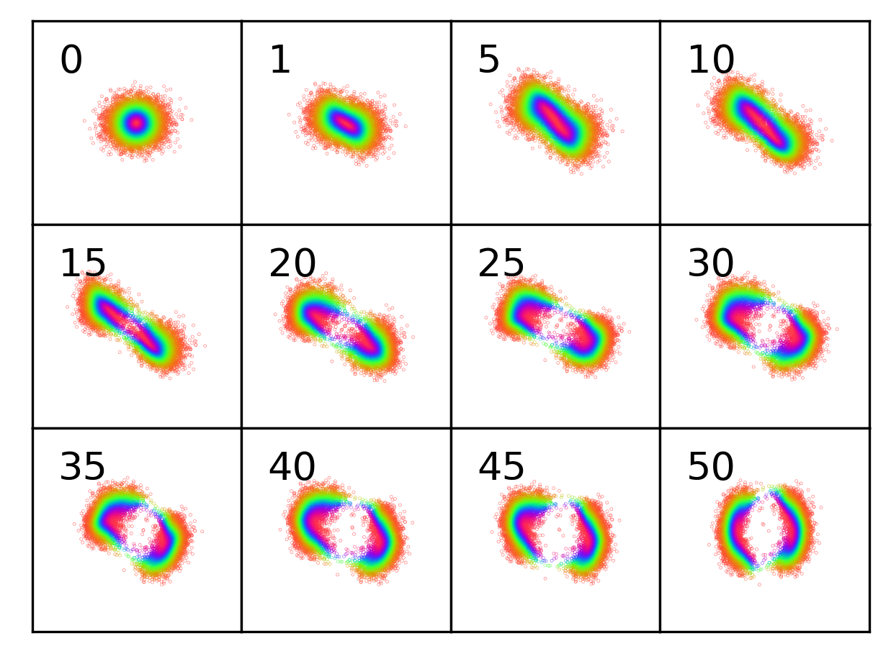
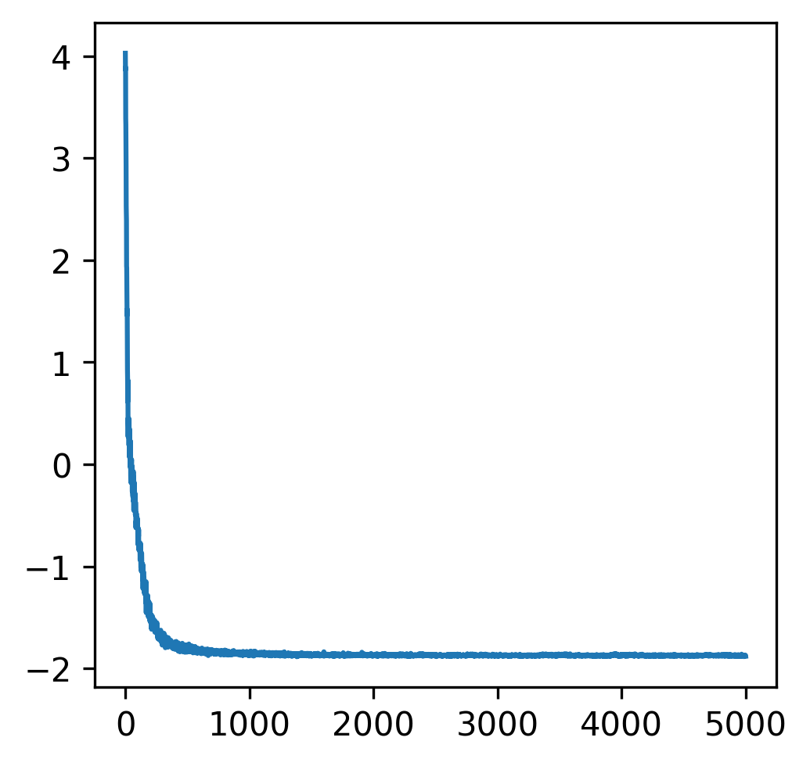
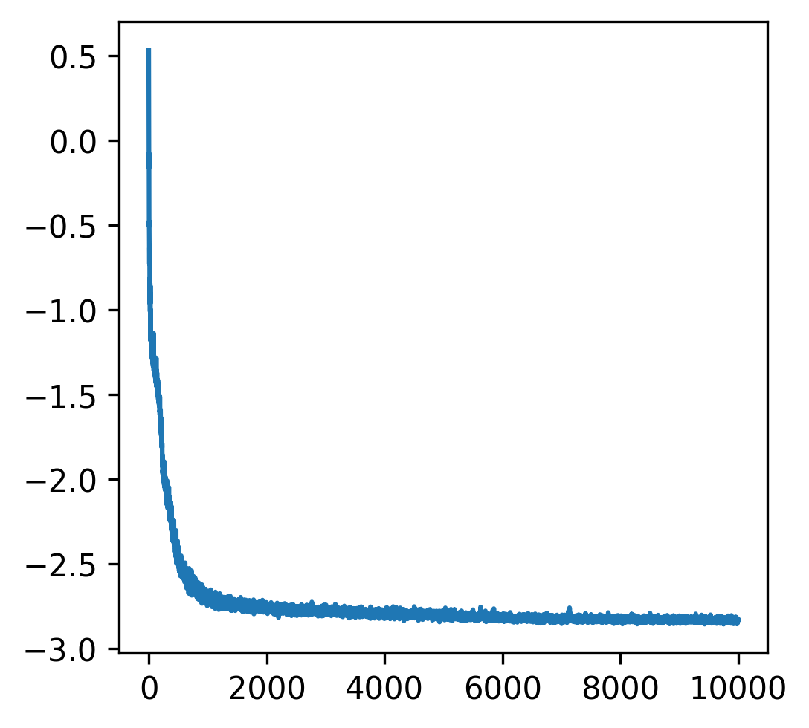

# VI with normalizing flows

This repo documents my attempt at reproducing "Variational Inference with Normalizing Flows" in PyTorch:

- Part 1: Approximating complex 2D distributions
- Part 2: Part 1 but amortized
- Part 3: Fitting VAE (2-dimensional latent space)
- Part 4: Fitting VAE (40-dimensional latent space)

## Part 1: Approximating complex 2D distributions

### Notes

I reproduced Section 6.1 using **planar flows** with the following changes:

- *Jacobian computation.* I used `torch.autograd.functional.jacobian` instead of Eq. 12 to compute the jacobian of the transformation; this is less efficient but (1) I'm only using $D=2$ and (2) it's easier to debug.
- *Invertibility.* I found that I didn't have to enforce invertibility as discussed in Section A.1; during training, the dot product between $\vec{w}$ and $\vec{u}$ was always greater than -1. Explicitly enforcing this constraint in my code led to bad results (i.e., the learned density didn't resemble the true density). Maybe I was doing it wrong...
- *Tapering.* By definition, potential functions 2, 3 and 4 extend indefinitely in the horizontal direction. I created a tapering mask to resolve this issue. Note that my code still works perfectly fine without tapering, but I do think that without tapering the densities are degenerate.

### Questions

- How to evalute $q_K(z_K)$ for some arbitrary $z_K$? Interesting conversation [here](https://groups.google.com/a/tensorflow.org/g/tfprobability/c/KouBOt9HQa8).

### Hyperparameters

- 100 layers of planar flows
- 1000 samples from $q_K$ to estimate KL
- Adam with a learning rate of 2e-3
- 10000 gradient steps (convergence takes much fewer steps but I trained longer anyway)

### Plots

- 1st image: unnormalized true density
- 2nd image: empirical learned density
- 3rd image: sampled points after passing through the $n$-th layer (each is colored by its distance to $\mu$ before passing through any layer)
- 4th image: estimated KL against number of gradient steps

Potential function $U_1$:

  
   
  
  

Potential function $U_2$ (tapered version):

  
   
  
  

Potential function $U_3$ (tapered version):

  
   
  
  

Potential function $U_4$ (tapered version):

  
   
  
  

A potential function I created:

  
   
  
  

## Fitting deep latent Gaussian models

TODO

