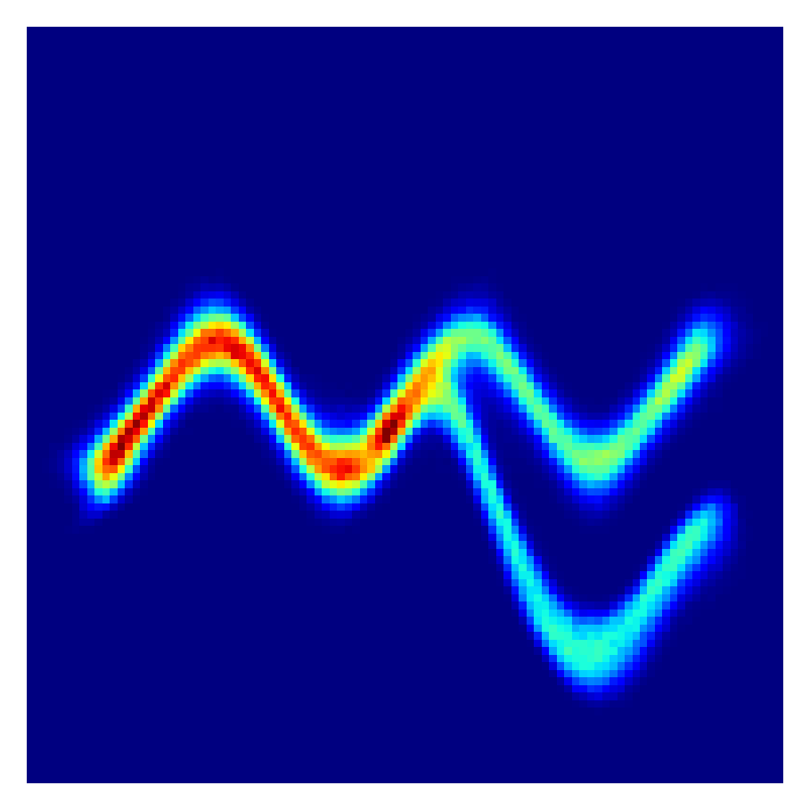
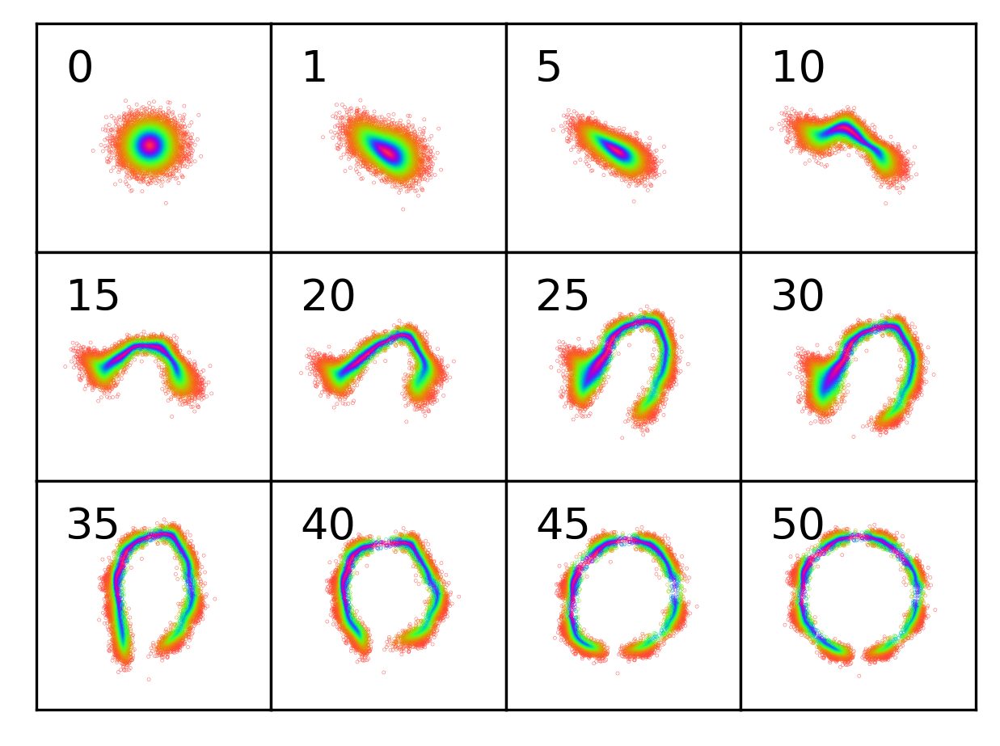

# Variational inference with normalizing flows

This is an unofficial implementation of "Variational inference with normalizing flows".

```bibtex
@inproceedings{rezende2015variational,
  title={Variational inference with normalizing flows},
  author={Rezende, Danilo and Mohamed, Shakir},
  booktitle={International conference on machine learning},
  pages={1530--1538},
  year={2015},
  organization={PMLR}
}
```

## Unconditional variational inference

See `core.py` and `nf_for_uncond_vi.ipynb`.

Legend:

- 1st image: unnormalized true density
- 2nd image: empirical learned density
- 3rd image: sampled points after passing through the $n$-th layer (each is colored by its distance to $\mu$ before passing through any layer)
- 4th image: estimated KL against number of gradient steps

Potential function $U_1$:

<p align="middle">
  
   
  
  
</p>

Potential function $U_2$ (tapered version):

<p align="middle">
  
   
  
  
</p>

Potential function $U_3$ (tapered version):

<p align="middle">
  
   
  
  
</p>

Potential function $U_4$ (tapered version):

<p align="middle">
  
   
  
  
</p>

A potential function I created:

<p align="middle">
  
   
  
  
</p>

## Conditional variational inference

See `core_vectorized.py` and `nf_for_cond_vi.ipynb`.


## Training VAEs

See `nfvae_train.py` and `nfvae_plot_learning_curves.py`.


