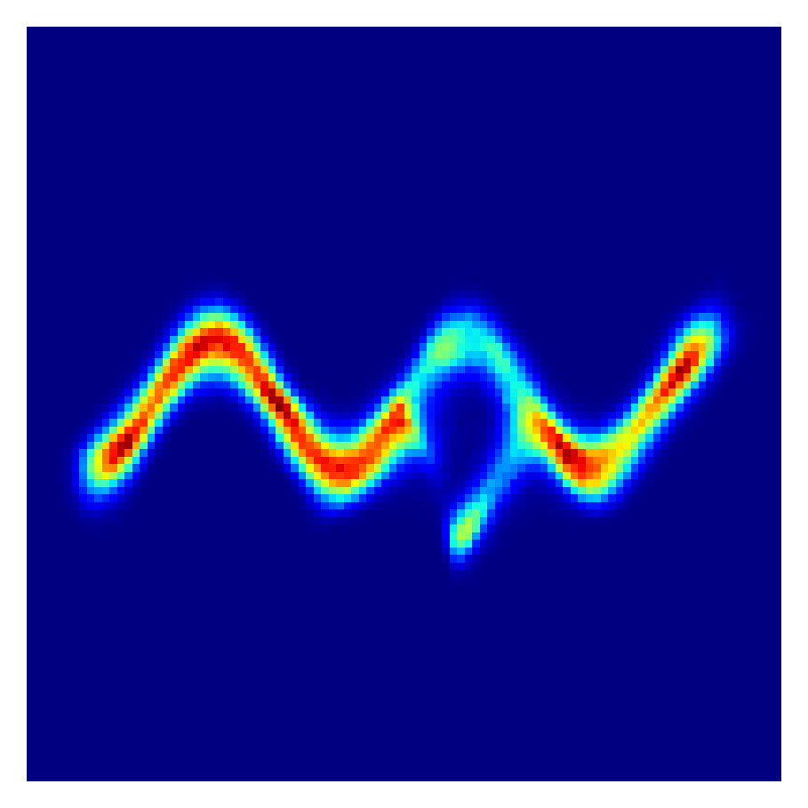
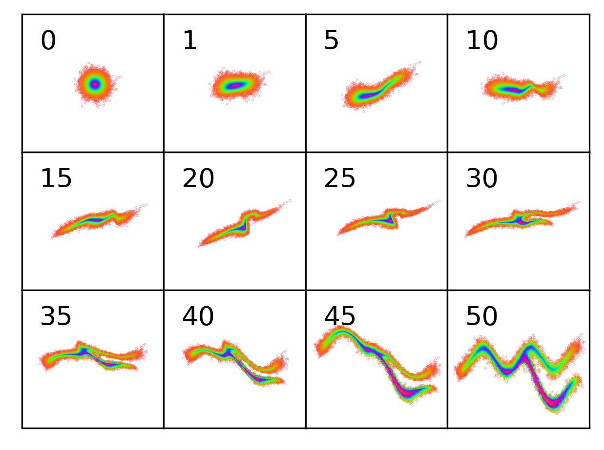
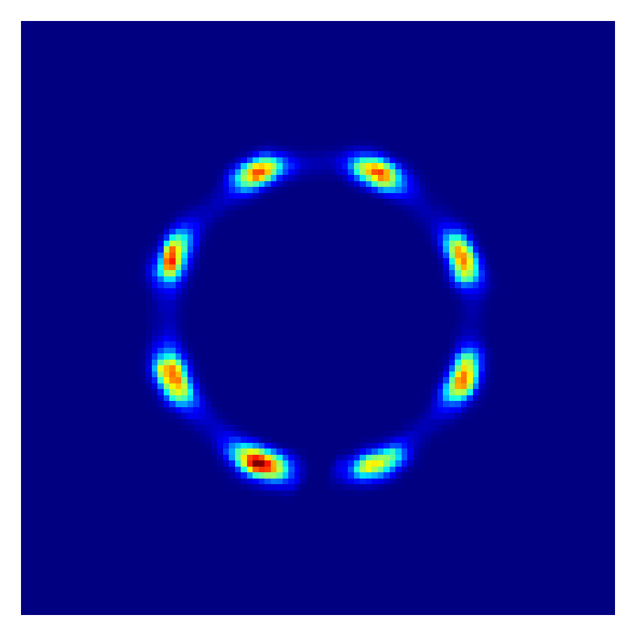

# VI with normalizing flows

This repo documents my attempt at reproducing "Variational Inference with Normalizing Flows" in PyTorch. 

## Approximating complex 2D distributions

### Notes

I reproduced Section 6.1 using **planar flows** with the following hacks:

- *Jacobian computation.* I used `torch.autograd.functional.jacobian` instead of Eq. 12 to compute the jacobian of the transformation; this is less efficient but (1) I'm only using $D=2$ and (2) it's easier to debug.
- *Invertibility.* I found that I didn't have to enforce invertibility as discussed in Section A.1 ;during training, the dot product between $\vec{w}$ and $\vec{u}$ was always greater than -1. Explicitly enforced this constraint in my code led to bad results (i.e., the learned density didn't resemble the true density). Maybe I was doing it wrong...
- *Tapering.* By definition, potential functions 2, 3 and 4 extend indefinitely in the horizontal direction. I created a tapering mask to resolve this issue. Note that my code still works perfectly fine without tapering, but I do think that without tapering the densities are degenerate.

### Questions

- How to evalute $q_K(z_K)$ for some arbitrary $z_K$? Interesting conversation [here](https://groups.google.com/a/tensorflow.org/g/tfprobability/c/KouBOt9HQa8).

### Hyperparameters

- 100 layers of planar flows
- 1000 samples from $q_K$ to estimate KL
- Adam with a learning rate of 2e-3
- 30000 gradient steps (convergence reached at around 5000 steps but I trained longer anyway)

### Plots

- First image: unnormalized true density
- Second image: empirical learned density
- Third image: sampled points after the $n$-th layer (each point is colored by its distance from $\mu$ of $q_0$ prior to all layers)

Potential function $U_1$:

  
   
  

Potential function $U_2$ (tapered version):

  
   
  

Potential function $U_3$ (tapered version):

  
   
  

Potential function $U_4$ (tapered version):

  
   
  

A potential function I created:

  
   
  

